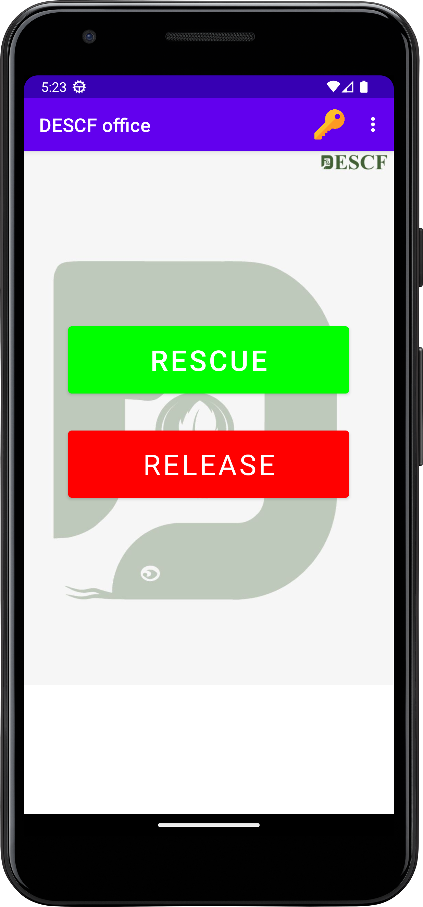

# DESCF Office App
This App was Created By Sadman Sakib Mahee!
 
Hi i have made this app using Java and for database i have used Firebase because firebase is easy to use and it is free. This is the Office Version of this DESCF app.it will use only the admins.
 
- This app is a simple app which can be used to store your daily expenses and income.
 
- This app is very easy to use and it is very user friendly.
   
- Beautiful UI
 
 

# SCREENSHOTS

 - ## Login Page:
    This is the login page of the app. Here Admin can login with the email and password.
     
     
    
     
     
    
-  ## Home page:
   This is the home page of the app. Here there is Two Options available for Admin One is Rescue and Another is Release. From these option admin can access the informations and can download the medias which is uploaded by the user.

     
     
    
     
     

-  ## Change Key page: 
    This is the Change Key page of the app. Here admin can change the key of the app. This key is used to access the app. If the key is wrong then the app will not open for the user.This key will work as a invitation code
      
      
     
      
      
-  ## Rescue page: 
    This is the rescue page of the app. Where admin can see the details of the rescue like Snake id , Snake name etc. Also the main important Authorisers name. Here admin can download the files of every rescue.
      
      
     
      
      
-  ## Release page:
    This is the Release page of the app. Where admin can see the details of the Release like Snake id , Snake name etc. Also the main important Authorisers name. Here admin can download the files of every Release.
      
      
     
      
      
